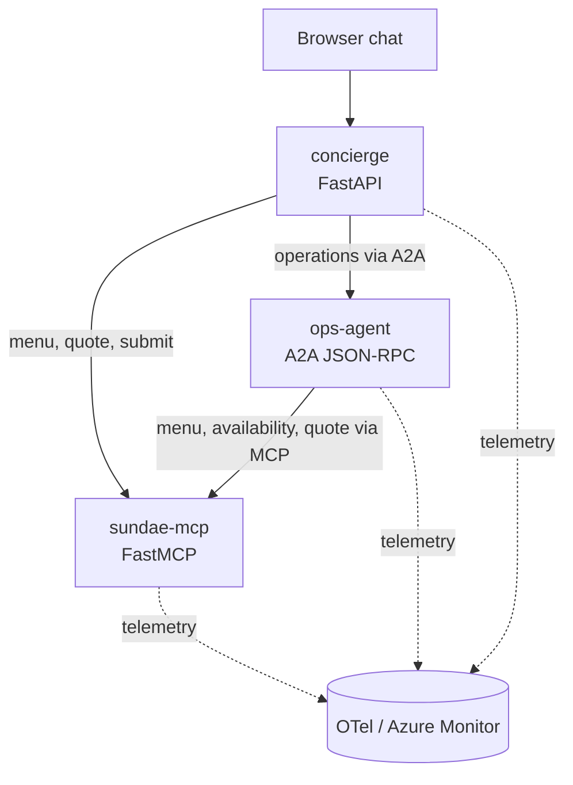

# Sundae Funday

Sundae Funday is a small, end-to-end demo of a customer-facing AI concierge that uses the Model Context Protocol (MCP) for tools and the Agent2Agent (A2A) protocol for delegation. Customers use a browser chat to explore the menu, build a sundae, check whether it can be prepared, and submit a confirmed order. Behind the chat, the concierge calls deterministic shop tools directly or delegates operational questions to a specialist agent. The same three application containers can run locally with Docker Compose or on Kubernetes (kind, minikube, AKS).

## What's in this repo

| Area           | Purpose                                                                                                                      |
| -------------- | ---------------------------------------------------------------------------------------------------------------------------- |
| `src/`         | Application code: concierge, sundae-mcp, and ops-agent services                                                              |
| `tests/`       | Unit tests for deterministic shop logic, protocol helpers, and routing                                                       |
| `deploy/k8s/`  | Kustomize base manifests and per-environment overlays (local, azure)                                                         |
| `deploy/otel/` | Docker Compose configs for the local observability stack (Collector, Grafana, Loki, Tempo, Prometheus)                       |
| `scripts/`     | Azure resource provisioning and deployment helpers                                                                           |
| `compose.yaml` | Single Compose file with profiles for the app (`app`), the full demo (`demo`), and the observability stack alone (`observe`) |

## How it works



The three application services have distinct responsibilities:

- **`concierge`** serves the chat interface and handles the customer session. It routes each message, keeps order drafts, and requires explicit confirmation before submitting an order.
- **`sundae-mcp`** owns the authoritative shop data and actions. It exposes MCP tools for the menu, inventory, quotes, and order submission.
- **`ops-agent`** is an A2A specialist for availability, inventory, pricing, and preparation-time questions. It must ground every response in a call to `sundae-mcp`, and it cannot submit orders.

This separation keeps shop behavior deterministic while still allowing agents to interpret customer requests and delegate work.

### Request flow

1. The browser sends a message to the `concierge`.
2. The concierge classifies the request as a menu question, an order draft, an operational question, or a general chat message.
3. Menu and order-draft requests use `sundae-mcp` for authoritative shop data.
4. Operational questions and every fulfillment decision go to `ops-agent` over
   A2A. The specialist calls the appropriate MCP tool before returning its
   answer.
5. A valid quote is stored as a pending draft in the concierge session.
6. The order is submitted through `sundae-mcp` only after the customer selects **Confirm and submit order**.

Prices use integer cents, and inventory, sessions, drafts, and orders are kept in memory to keep the demo self-contained. Restarting the services resets that state.

## MCP and A2A

MCP connects agents to deterministic tools and data. `sundae-mcp` exposes four tools over streamable HTTP:

| Tool                 | Purpose                                                |
| -------------------- | ------------------------------------------------------ |
| `list_menu`          | Returns sizes, flavors, sauces, toppings, and prices.  |
| `check_availability` | Checks current inventory and requested ingredients.    |
| `quote_order`        | Creates a priced draft and estimates preparation time. |
| `submit_order`       | Submits a confirmed draft with an idempotency key.     |

A2A connects the concierge to the operations specialist. The concierge sends questions such as "What are you running low on?" or "Can this be ready in ten minutes?" to `ops-agent`, which uses the MCP tools to produce a grounded response.

## Run the complete demo locally

### Prerequisites

- Docker with Docker Compose
- [Ollama](https://ollama.com/) running on the host

### Environment variables

Copy `.env.example` to `.env` and review the file. Variables are grouped into four sections:

| Group                | Purpose                                                                                                                                                                                      |
| -------------------- | -------------------------------------------------------------------------------------------------------------------------------------------------------------------------------------------- |
| OpenTelemetry        | Service namespace, OTLP endpoint (local vs. Docker mode)                                                                                                                                     |
| Application Insights | Azure connection string; leave empty for local dev                                                                                                                                           |
| Model client         | Base URL and chat model. Defaults to a local Ollama at `localhost:11434` with `qwen3:8b` as the model. Change these to point at any OpenAI-compatible endpoint (Azure OpenAI, LiteLLM, etc.) |
| Service URLs         | Local endpoints for the three services; only relevant when overriding defaults                                                                                                               |

### Model selection

The demo ships with `qwen3:8b` as the default model because it downloads quickly and runs on most laptops. Any OpenAI-compatible chat model works in its place; just update `OPENAI_BASE_URL` and `OPENAI_CHAT_MODEL` in `.env`. For Azure deployments, point at your endpoint and use a model like `gpt-4.1-mini`.

### Quick start

Copy the environment file, pull the model (if using local Ollama), and start everything:

```bash
cp .env.example .env
ollama pull qwen3:8b
docker compose --profile demo up -d --build --wait
```

Open `http://localhost:8301` and try one of these prompts:

- `Show me the menu.`
- `Build me a classic sundae with vanilla and chocolate, hot fudge, and a cherry.`
- `Can you make a deluxe mint chip sundae in 10 minutes?`
- `What are you running low on tonight?`
- `What can you make fastest right now?`

When the concierge creates a valid draft, use the confirmation button in the page to submit it. The local services are available at:

| Service    | URL                     |
| ---------- | ----------------------- |
| Concierge  | `http://localhost:8301` |
| Grafana    | `http://localhost:3000` |
| Prometheus | `http://localhost:9090` |
| Loki       | `http://localhost:3100` |
| Tempo      | `http://localhost:3200` |

Stop the demo with:

```bash
docker compose --profile demo down
```

The Compose profiles can also run only the three application services with `--profile app`, or only the local observability stack with `--profile observe`.

## Observability

All three application services use a shared OpenTelemetry module that instruments ASGI and HTTPX and emits traces, metrics, and logs.

- Local Compose sends OTLP telemetry to an OpenTelemetry Collector. The local stack stores and visualizes data with Grafana, Loki, Tempo, and Prometheus.
- AKS uses `APPLICATIONINSIGHTS_CONNECTION_STRING` to send telemetry through the Azure Monitor exporters, but any environment that sets that variable gets the same behavior.
- Each application also exposes `/metrics` for Prometheus scraping.

## Kubernetes manifests

The base Kustomize manifests under `deploy/k8s/base` define the namespace, Deployments, and Services for the three application containers. They are not tied to any specific cloud:

- **Kind / minikube / k3d**: use `overlays/local` for host-based Ollama and OTLP endpoints.
- **AKS**: use `scripts/azure-deploy.sh` to generate the ignored Azure env files
  from Terraform outputs, render `overlays/azure`, and deploy it.

## Azure deployment

Azure resources are expected to be provisioned separately with Terraform. The
deployment path requires `az`, `kubectl`, `kustomize`, Terraform output JSON,
and an active Azure CLI login.

```bash
az login
terraform -chdir=/path/to/terraform output -json > /tmp/sundae-outputs.json
TF_OUTPUT_JSON=/tmp/sundae-outputs.json bash scripts/azure-deploy.sh
```

GitHub Actions publishes commit-tagged images to GHCR after each push. The
deployment script generates the ignored `azure.config.env` and
`azure.secret.env` files, verifies workload identity federation, renders the
Azure overlay, applies it to AKS, waits for rollouts, and prints the endpoint.

See [`docs/azure.md`](docs/azure.md) for required Terraform outputs, workload
identity requirements, fork-specific GHCR configuration, and rendering options.

## Development

The Python project requires Python 3.12 and uses [uv](https://docs.astral.sh/uv/) for dependency management.

```bash
uv sync --dev
uv run ruff check .
uv run ruff format --check .
uv run pyright
uv run pytest
docker compose config
kubectl kustomize deploy/k8s/overlays/local
kubectl kustomize deploy/k8s/overlays/azure
```

Equivalent convenience targets are available:

```bash
make check        # lint, format-check, typecheck, test
make build        # docker compose build sundae-mcp, ops-agent, concierge
make up           # bring local demo env up (Ollama + services)
make down         # bring demo env down
make azure-deploy # generate Azure env files and deploy to AKS
make kind-create  # create a Kind cluster and deploy the local overlay
make kind-delete  # delete the local Kind cluster
```

The test suite covers deterministic shop behavior, protocol helpers, and concierge routing. It does not require Docker, a live model, or Azure resources.
