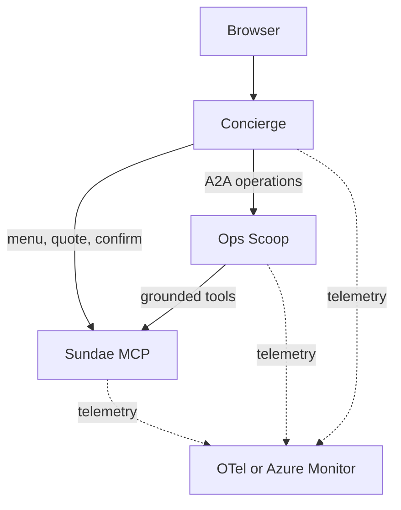

# Sundae Funday

Sundae Funday is a compact MCP and A2A demo. A browser concierge builds sundae quotes, an operations agent checks fulfillment, and a deterministic MCP service owns catalog, inventory, drafts, and submissions.

## Architecture



All three services are installed from the `sundae_funday` Python package and run from one container image. `SERVICE` selects `sundae-mcp`, `ops-agent`, or `concierge` at runtime.

| Service      | Port | Responsibility                                       |
| ------------ | ---: | ---------------------------------------------------- |
| `sundae-mcp` | 8101 | Menu, availability, quotes, and order submission     |
| `ops-agent`  | 8202 | Tool-grounded inventory and fulfillment decisions    |
| `concierge`  | 8301 | Browser, sessions, routing, drafts, and confirmation |

The MCP service exposes `list_menu`, `check_availability`, `quote_order`, and `submit_order`. Only the concierge confirmation action submits a draft.

## Local quick start

Requirements:

- Docker Engine with Docker Compose
- Ollama on the host

```bash
cp .env.example .env
ollama pull qwen3:8b
docker compose up -d --build --wait
```

Open [http://localhost:8301](http://localhost:8301).

> [!note]
> The Linux host mapping for `host.docker.internal` is included in Compose.

Useful prompts:

- `Show me the menu.`
- `Build me a classic sundae with vanilla and chocolate, hot fudge, and a cherry.`
- `Got any specials tonight?`
- `Surprise me.`

Stop the stack:

```bash
docker compose down
```

## Development

Python 3.12 and [uv](https://docs.astral.sh/uv/) are required.

```bash
uv sync --dev
make check
```

> [!note]
> `make check` validates without modifying files. Formatting is explicit:

```bash
make format
```

Build the shared image:

```bash
make build
```

The image version defaults to the project version in `pyproject.toml`. `APP_VERSION` is the only runtime version override.

## Kubernetes

Helm is used to package the app for Kubernetes.

```bash
helm lint deploy/helm/sundae-funday
helm template sundae-funday deploy/helm/sundae-funday --namespace demo
```

Local Kind:

> [!note]
> The `compose.yaml` runs the observability stack in containers and publishes it on the host. Kind workloads export telemetry to the OpenTelemetry Collector through the Docker host, and Grafana is available at [http://localhost:3000](http://localhost:3000).

```bash
make kind-create
make kind-delete
```

## Local networking

The `deploy/helm/values-local.yaml` sends model requests and telemetry to the Docker host at `172.17.0.1`.

Find the Kind node's host gateway with:

```bash
docker inspect sundae-control-plane \
  --format '{{range .NetworkSettings.Networks}}{{.Gateway}}{{end}}'
```

You can override the URLs if the reported address differs:

```bash
make kind-create \
  OPENAI_BASE_URL=http://host-address:11434/v1 \
  OTEL_EXPORTER_OTLP_ENDPOINT=http://host-address:4318
```

The three application pods share the Kind node network. They call each other through `127.0.0.1`, reach host services through the Docker bridge, and expose the concierge at [http://localhost:8301](http://localhost:8301).

The `deploy/kind-config.yaml` creates the single control-plane node and maps its NodePort `30001` to host port `8301`. See the [chart README](deploy/helm/sundae-funday/README.md#local-kind-networking) for the full network path.

Azure uses `deploy/helm/values-azure.yaml` plus secure values generated from
Terraform outputs:

```bash
TF_OUTPUT_JSON=/tmp/sundae-outputs.json make azure-deploy
```

See [docs/azure.md](docs/azure.md).

## Compatibility decisions

The refactor intentionally adopts these defaults:

- CI builds one image. The three previous GHCR names are compatibility tags on
  the same build.
- Helm replaces the duplicated Kustomize base and overlays.
- Browser behavior, accessibility, URLs, payloads, persistence, and copy are
  preserved; pixel-identical rendering is not a requirement.
- The unsupported Azure setup and teardown scripts are removed. Terraform owns
  resource provisioning.
- `GRAHAM_CRACKERS` is now an authoritative topping because the browser already
  offered it.
- API keys are rendered only in Kubernetes Secrets.
- The incorrectly cased Kustomize telemetry key and duplicated local API key
  disappear with the obsolete manifests.
