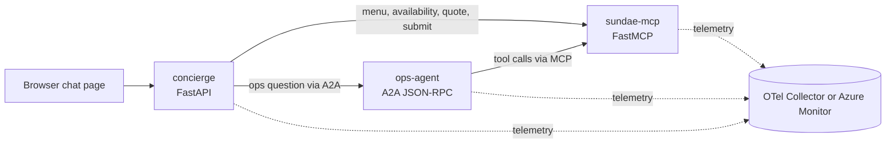

# Sundae Funday

Sundae Funday is a slim public demo that shows the same architectural ideas as a larger food ordering system without the extra baggage.

- MCP holds deterministic shop facts and actions.
- A2A lets the customer concierge hand operational questions to a specialist.
- The same three app containers run in local Docker Compose and on AKS.
- The same OpenTelemetry setup targets a local LGTM stack or Azure Monitor.

## Architecture



## MCP vs A2A in this repo

MCP is for tools and facts. `sundae-mcp` owns the menu, inventory snapshot, quotes, and idempotent order submission. Prices are integer cents and inventory is kept in memory for demo simplicity.

A2A is for specialist-to-specialist delegation. The customer-facing `concierge` handles the browser, drafts, and explicit confirmation. `ops-agent` answers operational questions, and every answer must call MCP first.

## Services

- `sundae-mcp` exposes four deterministic tools over streamable HTTP.
- `ops-agent` exposes an agent card plus JSON-RPC A2A routes.
- `concierge` serves a tiny chat page, `/api/chat`, `/api/confirm`, and `/healthz`.

## Local quick start

```bash
cp .env.example .env
ollama pull qwen3:8b
docker compose --profile demo up -d --build --wait
```

Open `http://localhost:8301`.

Useful local endpoints:

- Concierge: `http://localhost:8301`
- Grafana: `http://localhost:3000`
- Prometheus: `http://localhost:9090`
- Loki: `http://localhost:3100`
- Tempo: `http://localhost:3200`

To stop everything:

```bash
docker compose --profile demo down
```

## Sample prompts

- `Show me the menu.`
- `Build me a classic sundae with vanilla and chocolate, hot fudge, and a cherry.`
- `Can you make a deluxe mint chip sundae in 10 minutes?`
- `What are you running low on tonight?`
- `What can you make fastest right now?`

## Developer commands

```bash
uv sync --dev
uv run ruff check .
uv run ruff format --check .
uv run pyright
uv run pytest
docker compose config
kubectl kustomize deploy/k8s/overlays/local
kubectl kustomize deploy/k8s/overlays/azure
```

Or use the convenience targets:

```bash
make check
make build
make demo-up
```

## Observability

The shared telemetry module instruments ASGI and httpx and exports traces, metrics, and logs.

- Local Compose uses OTLP to an OpenTelemetry Collector, then Grafana Loki, Tempo, and Prometheus.
- AKS sets `APPLICATIONINSIGHTS_CONNECTION_STRING` to switch the exporters to Azure Monitor.
- Pods also expose `/metrics` so managed Prometheus can scrape them directly.

## Kubernetes

Kustomize files live under `deploy/k8s`.

- `base` contains the three Deployments, three Services, namespace, and shared ConfigMap.
- `overlays/local` targets a local cluster plus host-based Ollama and OTLP endpoints.
- `overlays/azure` keeps Azure friendly placeholders for ACR, Application Insights, and the model endpoint.

## Azure path

The Azure scripts do not deploy anything by themselves during development here, but they document the full AKS path:

```bash
bash scripts/azure-setup.sh
bash scripts/azure-deploy.sh
```

See `docs/azure.md` for the required environment variables and what each script does.

## Testing scope

Pytest covers deterministic shop behavior plus protocol helpers and concierge routing helpers. No Docker daemon, live model, or cloud resources are required for the test suite.
