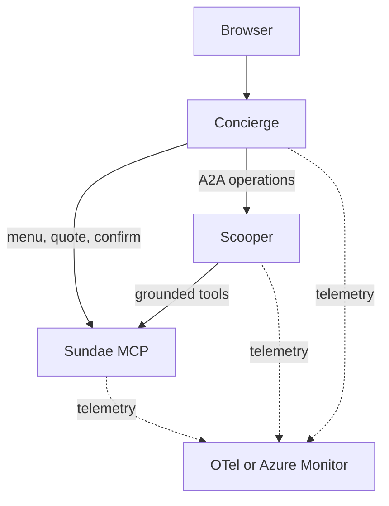

# Sundae Funday

Sundae Funday is a compact MCP and A2A demo. A browser concierge builds sundae quotes, an operations agent checks fulfillment, and a deterministic MCP service owns catalog, inventory, drafts, and submissions.

## Architecture



All three services are installed from the `sundae_funday` Python package and run from one container image. `SERVICE` selects `sundae-mcp`, `ops-agent`, or `concierge` at runtime.

| Service      | Port | Responsibility                                       |
| ------------ | ---: | ---------------------------------------------------- |
| `sundae-mcp` | 8101 | Menu, availability, quotes, and order submission     |
| `ops-agent`  | 8202 | Tool-grounded inventory and fulfillment decisions    |
| `concierge`  | 8301 | Browser, sessions, routing, drafts, and confirmation |

The MCP service exposes `list_menu`, `check_availability`, `quote_order`, and `submit_order`. Only the concierge confirmation action submits a draft.

Routing and operations planning use Chat Completions JSON-schema output, validated
with Pydantic. Invalid output gets one retry with validation feedback. The router
then logs and falls back to deterministic routing; an invalid Scooper plan fails
explicitly without executing a tool. Models must support `response_format` with
`json_schema`. Model endpoint failures are reported, not silently treated as valid
plans.

Specials are a routing intent, not a keyword override ahead of the model. With the
concierge model disabled, or after both validation attempts fail, the fallback
router still recognizes the demo prompts. Scooper executes only its validated
menu, availability, or quote plan; submission is not in its model-facing schema.

"Surprise me" reuses the specials recipe: a Classic with the highest-stock flavor,
sauce, and two available toppings. When only one scoop of each flavor remains, it
combines two flavors rather than promising two scoops of one. It fetches live
inventory, quotes through MCP, and asks Scooper to verify fulfillment. The recipe
may repeat until stock changes, and quoting still does not reserve inventory.

## Local quick start

Requirements:

- Docker Engine with Docker Compose
- Ollama on the host

```bash
cp .env.example .env
ollama pull qwen3:8b
docker compose up -d --build --wait
```

Open [http://localhost:8301](http://localhost:8301).

> [!note]
> The Linux host mapping for `host.docker.internal` is included in Compose.

Useful prompts:

- `Show me the menu.`
- `Build me a classic sundae with vanilla and chocolate, hot fudge, and a cherry.`
- `Got any specials tonight?`
- `Surprise me.`

Stop the stack:

```bash
docker compose down
```

## Development

Python 3.12 and [uv](https://docs.astral.sh/uv/) are required.

```bash
uv sync --dev
make check
```

> [!note]
> `make check` validates without modifying files. Formatting is explicit:

```bash
make format
```

Build the shared image:

```bash
make build
```

The image version defaults to the project version in `pyproject.toml`. `APP_VERSION` is the only runtime version override.

## Kubernetes

Helm is used to package the app for Kubernetes.

```bash
helm lint deploy/helm/sundae-funday
helm template sundae-funday deploy/helm/sundae-funday --namespace demo
```

Local Kind:

> [!note]
> The `compose.yaml` runs the observability stack in containers and publishes it on the host. Kind workloads export telemetry to the OpenTelemetry Collector through the Docker host, and Grafana is available at [http://localhost:3000](http://localhost:3000).

```bash
make kind-create
make kind-delete
```

## Local networking

The `deploy/helm/values-local.yaml` sends model requests and telemetry to the Docker host at `172.17.0.1`.

Find the Kind node's host gateway with:

```bash
docker inspect sundae-control-plane \
  --format '{{range .NetworkSettings.Networks}}{{.Gateway}}{{end}}'
```

You can override the URLs if the reported address differs:

```bash
make kind-create \
  OPENAI_BASE_URL=http://host-address:11434/v1 \
  OTEL_EXPORTER_OTLP_ENDPOINT=http://host-address:4318
```

The three application pods share the Kind node network. They call each other through `127.0.0.1`, reach host services through the Docker bridge, and expose the concierge at [http://localhost:8301](http://localhost:8301).

The `deploy/kind-config.yaml` creates the single control-plane node and maps its NodePort `30001` to host port `8301`. See the [chart README](deploy/helm/sundae-funday/README.md#local-kind-networking) for the full network path.

## Azure deployment

For Azure, see the [aks-for-agents-with-hcp-tf-stacks](https://github.com/pauldotyu/aks-for-agents-with-hcp-tf-stacks) for an example of Terraform provisioning. Using the Terraform outputs, update the `deploy/helm/values-azure.yaml` to include your deployment values.

Connect to the AKS cluster:

```bash
az aks get-credentials --resource-group <rg> --name <aks>
```

Install the Helm chart:

```bash
helm upgrade --install sundae-funday deploy/helm/sundae-funday \
  --namespace demo \
  --create-namespace \
  --values deploy/helm/values-azure.yaml
```

## AKS scaling demo

Keep the story focused: run locally, prepare the container and deployment
configuration with AKS dev tools, deploy, then use AKS desktop to inspect and scale
Scooper. The Dockerfile and Helm chart are the known-good reference. For live
configuration generation, prepare a separate starter checkout without those
artifacts in advance; do not overwrite the working deployment during the demo.
Provision the cluster, registry access, model access, and developer permissions
before presenting.

### Enable a repeatable capacity problem

Scooper has an opt-in simulation of finite per-pod capacity. With these settings,
each pod processes two operations at a time, with one second of simulated work
per operation. Requests still use the real concierge -> A2A -> MCP path.
This demonstrates agent-service queueing, not faster LLM inference.

Deploy your built image using the configured Azure values:

```bash
helm upgrade --install sundae-funday deploy/helm/sundae-funday \
  --namespace demo --create-namespace \
  --values deploy/helm/values-azure.yaml \
  --set-string image.tag=<your-image-tag> \
  --set-string config.OPS_DEMO_WORK_SECONDS=1 \
  --set-string config.OPS_DEMO_CONCURRENCY=2 \
  --set components.opsAgent.replicas=1 \
  --wait
```

For a local preview of queueing, set `OPS_DEMO_WORK_SECONDS=1` in `.env` and
run `make up`. Zero (the default) disables both simulated work and the concurrency
cap. Use normal pod networking on AKS for the scaling demonstration, not the
single-node, host-network Kind profile.

### Measure, inspect, scale, repeat

For a repeatable **capacity-only** measurement, disable model calls in the
concierge before the run. This restarts that pod and clears its conversations;
finish any interactive orders first. Scooper keeps its existing model settings,
but the structured specials operation does not invoke its model.

```bash
kubectl -n demo set env deployment/concierge OPENAI_BASE_URL= OPENAI_CHAT_MODEL=
kubectl -n demo rollout status deployment/concierge
```

1. Open the app in the browser and ask `Got any specials today?`.
2. In AKS desktop, open the app's namespace or import it as a Project. Inspect
   the three workloads and the `ops-agent` pod logs.
3. Run the bounded load below against the concierge URL. It starts independent
   customer sessions asking for specials; it never quotes or submits orders.
4. While load is running, inspect Scooper's `queue_wait_ms`, `processing_ms`,
   `pod`, and `outcome` log fields. `trace_id` links to distributed traces when
   tracing is enabled. Queued I/O work need not show high CPU.
5. Scale **only `ops-agent` from 1 to 3** in AKS desktop. Wait for all three pods
   to become ready, then rerun the identical command for a clean comparison.
   Look for requests across all three pods, less queueing, and lower p95 latency.

```bash
uv run python scripts/load.py --url http://<concierge-address> \
  --requests 120 --concurrency 12
```

The JSON report includes successful requests/second, p50/p95 latency in
milliseconds, and failures. Percentiles cover successful requests only; any failed
or malformed response makes the command exit nonzero. Compare runs with zero
failures, the same request count/concurrency, and no rollout in progress.
This is fixed-concurrency load, not a fixed arrival rate. With the concierge
model disabled as above, the specials path skips model calls so a shared model
endpoint cannot obscure the scaling result. With models enabled, specials use the
model router too, so the measured latency also includes inference.

After the capacity demo, remove the temporary overrides to restore model settings
from the chart's ConfigMap:

```bash
kubectl -n demo set env deployment/concierge OPENAI_BASE_URL- OPENAI_CHAT_MODEL-
kubectl -n demo rollout status deployment/concierge
```

Keep concierge and MCP at **one replica**: their conversation, inventory, draft,
and idempotency state is in memory. Scooper calls use fresh A2A tasks, and its
client does not retain idle HTTP connections that could pin subsequent calls to
one pod. This demo does not support cross-pod continuation of long-running tasks.

To reset, scale Scooper back to one replica. To disable simulation, set
`config.OPS_DEMO_WORK_SECONDS` back to `"0"` and redeploy with the same image and
Azure values. A Helm upgrade reapplies the replica count from its values.
Use synthetic data and restricted demo access; this is not a production blueprint.
